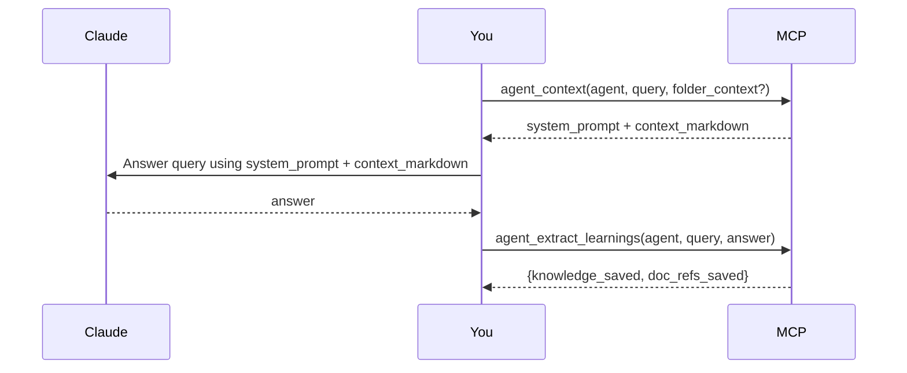

# gabos-mcp

A personal MCP server.

## Docker

```bash
docker compose up
```

Configure via `docker-compose.yml` (copy from `docker-compose.yml-example`). Environment variables:

| Variable               | Default                                 | Description                                       |
| ---------------------- | --------------------------------------- | ------------------------------------------------- |
| `MCP_TRANSPORT`        | `streamable-http`                       | Transport protocol (`stdio` or `streamable-http`) |
| `MCP_HOST`             | `0.0.0.0`                               | Bind address (HTTP only)                          |
| `MCP_PORT`             | `8000`                                  | Listen port (HTTP only)                           |
| `GABOS_CHM_FILES`      | `{}`                                    | JSON mapping of apps to CHM file paths            |
| `GABOS_CHM_CACHE_DIR`  | _(auto)_                                | Override CHM cache directory                      |
| `GABOS_KNOWLEDGE_DB`          | `~/.local/share/gabos-mcp/knowledge.db` | Path to the knowledge SQLite database             |
| `GABOS_AGENTS_DB`             | `~/.local/share/gabos-mcp/agents.db`    | Path to the agents SQLite database                |
| `GABOS_BACKUP_DIR`            | _(none — backups disabled)_             | Absolute path to the backup folder                |
| `GABOS_BACKUP_TIME`           | `02:00`                                 | Time of day to run the backup (24h, local time)   |
| `GABOS_BACKUP_RETENTION_DAYS` | `30`                                    | Days to keep backups (0 = keep forever)           |
| `GITHUB_CLIENT_ID`            | _(none)_                                | GitHub OAuth app client ID (enables OAuth)        |
| `GITHUB_CLIENT_SECRET`        | _(none)_                                | GitHub OAuth app client secret                    |
| `MCP_BASE_URL`                | _(none)_                                | Public URL of the server (e.g. `https://my.host`) |

When all three `GITHUB_*`/`MCP_BASE_URL` variables are set, the server requires GitHub OAuth 2.1 authentication. When any are missing, the server runs without auth (suitable for local stdio usage).

### Backups

Set `GABOS_BACKUP_DIR` to enable daily backups. The server copies both databases once per day using SQLite's Online Backup API (safe against concurrent writes) and deletes files older than `GABOS_BACKUP_RETENTION_DAYS` days. If a backup already exists for the current day it is skipped. Mount a volume in Docker so backups survive container restarts:

```yaml
volumes:
  - ./backups:/backups
environment:
  - GABOS_BACKUP_DIR=/backups
```

**Restore (manual):**

1. Stop the server.
2. Copy the backup file over the original database path, e.g. `cp backups/agents_2026-04-26.db ~/.local/share/gabos-mcp/agents.db`.
3. Start the server.

Backup files are plain SQLite databases and can be inspected with any SQLite client.

## Connect

### Claude Desktop — Remote (OAuth)

Go to **Settings > Connectors > Add custom connector**, select "Streamable HTTP", and enter the server URL (e.g. `https://mcp.example.ch/mcp`). Claude Desktop handles the OAuth flow automatically — it registers itself via Dynamic Client Registration, opens a browser window for GitHub login, and manages token refresh.

## Tools

### Agents

Agents are domain experts stored in the database. Each agent has a system prompt (persona), knowledge tags, and linked CHM documentation pages. They get smarter over time through use.

**Agent Q&A loop:**



The MCP assembles context from the knowledge store and CHM docs — **you** do the answering using that context. `agent_extract_learnings` calls `ctx.sample()` on the already-active session to extract and persist reusable facts; no external API key is required.

| Tool                      | Description                                                                           |
| ------------------------- | ------------------------------------------------------------------------------------- |
| `agent_create`            | Create a new agent with a name, description, system prompt, model, and knowledge tags |
| `agent_list`              | List all agents with name, owner, and description                                     |
| `agent_get`               | Get full details of an agent by name or ID                                            |
| `agent_update`            | Partially update an agent (owner only)                                                |
| `agent_delete`            | Delete an agent and all its doc refs (owner only)                                     |
| `agent_context`           | Assemble and return context (system prompt + knowledge + CHM pages) for a query       |
| `agent_learn`             | Manually save a fact into the knowledge store tagged to the agent                     |
| `agent_extract_learnings` | Extract and persist learnings from a completed Q&A via the active LLM session         |
| `agent_doc_ref_add`       | Link a CHM page to an agent + context key (e.g. a folder name)                        |
| `agent_doc_ref_list`      | List CHM pages linked to an agent, optionally filtered by context key                 |
| `agent_doc_ref_delete`    | Remove a specific doc ref by ID                                                       |

### Knowledge

A shared, tag-filtered knowledge store. Any authenticated user can add and read entries; only the owner can edit or delete.

| Tool               | Description                                             |
| ------------------ | ------------------------------------------------------- |
| `knowledge_add`    | Add a new knowledge entry with title, content, and tags |
| `knowledge_list`   | List entries, optionally filtered by owner or tag       |
| `knowledge_get`    | Get a single entry by ID                                |
| `knowledge_update` | Update an entry (owner only)                            |
| `knowledge_delete` | Delete an entry (owner only)                            |

### Docs (CHM)

Read and search CHM documentation files configured via `GABOS_CHM_FILES`.

| Tool                | Description                             |
| ------------------- | --------------------------------------- |
| `docs_list_apps`    | List configured CHM apps                |
| `docs_list_sources` | List sources within a CHM app           |
| `docs_list_pages`   | List pages within a CHM source          |
| `docs_read_page`    | Read the markdown content of a CHM page |
| `docs_search`       | Full-text search across a CHM app       |
| `docs_clear_cache`  | Clear the CHM extraction cache          |

### Claude Code — Remote (OAuth)

```bash
claude mcp add --transport http gabos-mcp https://mcp.fuet.ch/mcp
```

On first use, Claude Code opens your browser to complete the GitHub OAuth flow. Tokens are stored locally and refreshed automatically.
