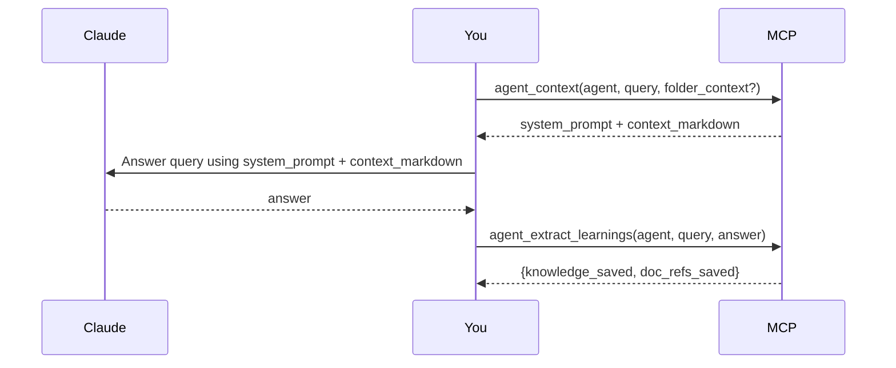

# gabos-mcp

A personal MCP server.

## Docker

```bash
docker compose up
```

Configure via `docker-compose.yml` (copy from `docker-compose.yml-example`). Environment variables:

| Variable                      | Default                                 | Description                                       |
| ----------------------------- | --------------------------------------- | ------------------------------------------------- |
| `MCP_TRANSPORT`               | `streamable-http`                       | Transport protocol (`stdio` or `streamable-http`) |
| `MCP_HOST`                    | `0.0.0.0`                               | Bind address (HTTP only)                          |
| `MCP_PORT`                    | `8000`                                  | Listen port (HTTP only)                           |
| `GABOS_CHM_FILES`             | `{}`                                    | JSON mapping of apps to CHM file paths            |
| `GABOS_CHM_CACHE_DIR`         | `~/.cache/gabos-mcp/chm`                | CHM extraction/index cache directory              |
| `GABOS_KNOWLEDGE_DB`          | `~/.local/share/gabos-mcp/knowledge.db` | Path to the knowledge SQLite database             |
| `GABOS_AGENTS_DB`             | `~/.local/share/gabos-mcp/agents.db`    | Path to the agents SQLite database                |
| `GABOS_BACKUP_DIR`            | _(none — backups disabled)_             | Absolute path to the backup folder                |
| `GABOS_BACKUP_TIME`           | `02:00`                                 | Time of day to run the backup (24h, local time)   |
| `GABOS_BACKUP_RETENTION_DAYS` | `30`                                    | Days to keep backups (0 = keep forever)           |
| `GITHUB_CLIENT_ID`            | _(none)_                                | GitHub OAuth app client ID (enables OAuth)        |
| `GITHUB_CLIENT_SECRET`        | _(none)_                                | GitHub OAuth app client secret                    |
| `MCP_BASE_URL`                | _(none)_                                | Public URL of the server (e.g. `https://my.host`) |

When all three `GITHUB_*`/`MCP_BASE_URL` variables are set, the server requires GitHub OAuth 2.1 authentication. When any are missing, the server runs without auth (suitable for local stdio usage).

### Backups

Set `GABOS_BACKUP_DIR` to enable daily backups. The server copies both databases once per day using SQLite's Online Backup API (safe against concurrent writes) and deletes files older than `GABOS_BACKUP_RETENTION_DAYS` days. If a backup already exists for the current day it is skipped. Mount a volume in Docker so backups survive container restarts:

```yaml
volumes:
  - ./backups:/backups
environment:
  - GABOS_BACKUP_DIR=/backups
```

**Restore (manual):**

1. Stop the server.
2. Copy the backup file over the original database path, e.g. `cp backups/agents_2026-04-26.db ~/.local/share/gabos-mcp/agents.db`.
3. Start the server.

Backup files are plain SQLite databases and can be inspected with any SQLite client.

## Connect

### Claude Desktop — Remote (OAuth)

Go to **Settings > Connectors > Add custom connector**, select "Streamable HTTP", and enter the server URL (e.g. `https://mcp.example.ch/mcp`). Claude Desktop handles the OAuth flow automatically — it registers itself via Dynamic Client Registration, opens a browser window for GitHub login, and manages token refresh.

### Recommended Claude Desktop allow-list

Tools are named with a suffix that reflects their side-effect class, making per-tool allow-lists straightforward:

| Suffix                         | Side effect              | Suggested Claude Desktop setting |
| ------------------------------ | ------------------------ | -------------------------------- |
| `_read`, `_search`, `_context` | Read-only                | **Always allow**                 |
| `_write`, `_extract_learnings` | Creates or modifies data | **Allow once per session**       |
| `_delete`                      | Irreversible deletion    | **Ask each time**                |

## Tools

Tools are grouped by module and named `module_verb` or `module_verb_noun` so they sort alphabetically by domain.

### Permission model

- **Reads are open** to all authenticated users. Private items (agents and knowledge with `shared=false`) are hidden from non-owners but do not raise errors.
- **Writes and deletes are owner-only.** Only the resource owner may update or delete it.
- **Agent-tag ownership:** adding a tag of the form `agent:<name>` or `agent:<name>:folder:<key>` to a knowledge entry requires you to own that agent.

### Agents

Agents are domain experts stored in the database. Each agent has a system prompt (persona), knowledge tags, and linked CHM documentation pages. They get smarter over time through use.

**Agent Q&A loop:**



The MCP assembles context from the knowledge store and CHM docs — **you** do the answering using that context. `agent_extract_learnings` calls `ctx.sample()` on the already-active session to extract and persist reusable facts; no external API key is required.

| Tool                      | Description                                                                                                                                  |
| ------------------------- | -------------------------------------------------------------------------------------------------------------------------------------------- |
| `agent_read`              | List all visible agents (no args), or fetch a specific agent by name/ID. Pass `include_doc_refs=true` to include linked CHM pages.           |
| `agent_context`           | Assemble and return context (system prompt + knowledge + CHM pages) for a query.                                                             |
| `agent_extract_learnings` | Extract and persist learnings from a completed Q&A via the active LLM session.                                                               |
| `agent_write`             | Create (`mode="create"`) or update (`mode="update"`) an agent. Accepts optional `doc_refs` and `learnings` fields on both modes. Owner-only. |
| `agent_delete`            | Delete an agent (no `doc_ref_ids`) or remove specific doc refs (`doc_ref_ids` provided). Owner-only.                                         |

**agent_write modes:**

- `mode="create"` — `name`, `description`, `system_prompt` required; `model`, `knowledge_tags`, `auto_learn`, `shared` optional.
- `mode="update"` — `name_or_id` required; all other fields are partial overrides.
- `doc_refs` — list of `{context_key, app, source, page_path, relevance_note?}`. On update, additive: new entries are added, existing refs are left untouched.
- `learnings` — list of `{title, content, tags?, shared?}`. Written to the knowledge store with `agent:<name>` prepended. **Not deleted when the agent is deleted** — remove explicitly via `knowledge_delete`.

### Knowledge

A shared, tag-filtered knowledge store. Only the owner can edit or delete their entries.

| Tool               | Description                                                                                    |
| ------------------ | ---------------------------------------------------------------------------------------------- |
| `knowledge_read`   | Fetch a single entry by `id`, or list entries filtered by `owner`/`tag` with pagination.       |
| `knowledge_write`  | Create (`mode="create"`) or update (`mode="update"`) a knowledge entry. Owner-only for update. |
| `knowledge_delete` | Delete a knowledge entry. Owner-only.                                                          |

**knowledge_write modes:**

- `mode="create"` — `title` and `content` required; `id` must be omitted; `tags`, `shared` optional.
- `mode="update"` — `id` required; other fields are partial overrides.

### Docs (CHM)

Read and search CHM documentation files configured via `GABOS_CHM_FILES`.

| Tool          | Description                                                                                                                                                       |
| ------------- | ----------------------------------------------------------------------------------------------------------------------------------------------------------------- |
| `docs_search` | Full-text search across configured CHM apps. Use for free-text queries.                                                                                           |
| `docs_read`   | Browse apps/sources/pages or read a page. Behaviour: no args → list apps; `app` → list sources; `app+source` → list pages; `app+source+page_path` → read content. |

**Cache invalidation:**

The CHM cache is stored in `GABOS_CHM_CACHE_DIR` (default `~/.cache/gabos-mcp/chm`) with the layout `<cache_dir>/<app>/<source>/`. Deleting a subdirectory invalidates that cache and forces a rebuild on next access:

```bash
# Clear one source
rm -rf "$GABOS_CHM_CACHE_DIR/MYAPP/mysource"

# Clear one app
rm -rf "$GABOS_CHM_CACHE_DIR/MYAPP"

# Clear everything
rm -rf "$GABOS_CHM_CACHE_DIR"
```

The server detects external deletions and rebuilds automatically on next tool use — no restart required.

### Claude Code — Remote (OAuth)

```bash
claude mcp add --transport http gabos-mcp https://mcp.fuet.ch/mcp
```

On first use, Claude Code opens your browser to complete the GitHub OAuth flow. Tokens are stored locally and refreshed automatically.
